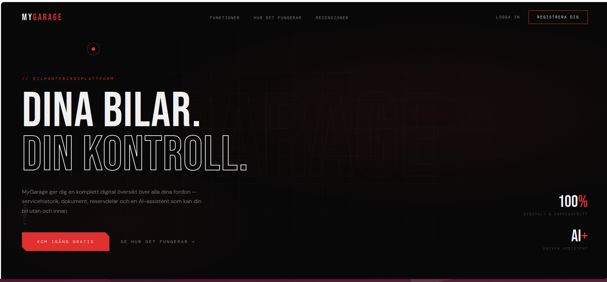
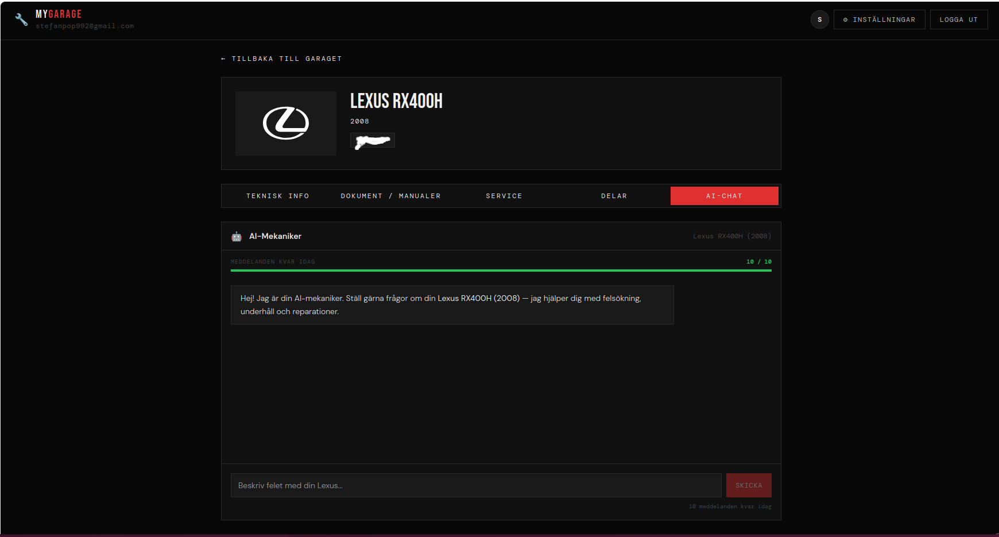
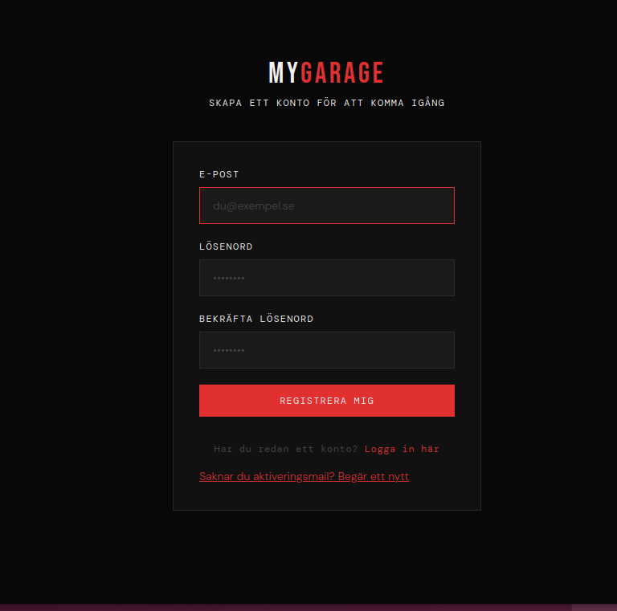
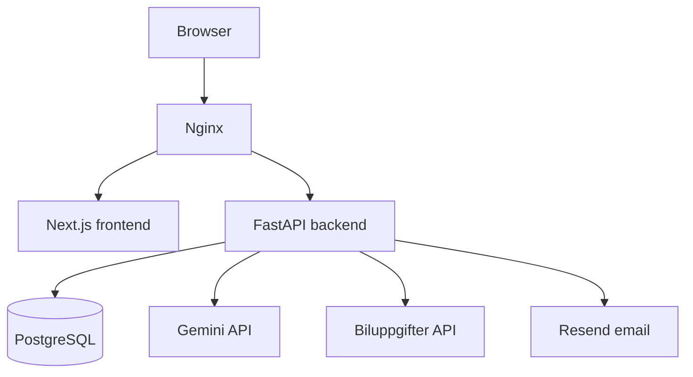

# AI-mech | MyGarage

A car-management web application with an AI assistant that uses vehicle details
and conversation history to answer questions about maintenance and repairs.
The interface is branded **MyGarage**.

**Stack:** Python · FastAPI · PostgreSQL · Next.js · TypeScript · Gemini API · Docker Compose

<p align="center">
  
</p>

## What the application includes

- Personal garages with vehicle information retrieved by registration number.
- An AI chat that receives the selected vehicle's specifications and chat history.
- Service logs, parts and uploaded vehicle documents.
- Account registration, email verification, session-based login and password recovery.
- Per-user garage data, with tests for isolation and account deletion behavior.

## Screenshots

### Context-aware AI chat



### Account registration



## AI assistant

The assistant uses a hosted Gemini model together with the selected vehicle's
specifications and conversation history. Uploaded documents are managed by the
application but are not automatically used as AI evidence.

Vehicle context, questions and chat history are sent to Gemini. Responses are
generated guidance, not verified diagnoses.

## Architecture



| Component | Responsibility |
| --- | --- |
| `frontend/src/` | Garage interface, account pages and AI chat |
| `backend/app/api/` | HTTP endpoints and request handling |
| `backend/app/services/` | Vehicle lookup, AI requests and garage access |
| `backend/app/db/` | Database models and sessions |
| `backend/alembic/` | Database migrations |
| `backend/tests/` | Garage isolation and password recovery checks |

## Run locally

Requires Docker with Compose and access to Gemini, Biluppgifter and Resend.
External services may require paid access. Run the following from the repository root:

```bash
cp .env.example .env
```

Edit `.env` before starting:

- Set a local database password in both `POSTGRES_PASSWORD` and `DATABASE_URL`.
  URL-encode special characters in the URL password.
- Add a Gemini API key for AI chat.
- Add a Biluppgifter API key for registration-number lookup.
- Configure Resend and a sender allowed by your account. Registration sends a
  verification email, and login requires a verified account.

```bash
docker compose up --build
```

Open **http://localhost**. Compose starts PostgreSQL, applies Alembic migrations,
and starts the backend, frontend and Nginx. Keep `FRONTEND_ORIGIN` and
`FRONTEND_URL` aligned with the address used in your browser; the example uses
`http://localhost` for the Compose setup.

A fresh account cannot complete the normal registration flow without working
email delivery. Missing vehicle or AI credentials also prevent those features
from working. This repository does not currently provide an offline demo mode.

```bash
docker compose down
```

This stops the stack while retaining its database and upload volumes.

## Tests

For a separate local Python environment, run from the repository root:

```bash
python3 -m venv .venv
.venv/bin/python -m pip install -r backend/requirements.txt
.venv/bin/python -m unittest discover -s backend/tests -v
```

Tests cover isolation between users' garages, preservation of another user's
data after account deletion, password validation, reset tokens and session
revocation. They use SQLite and mocked email behavior; they do not establish
that PostgreSQL migrations, the frontend or live provider integrations work.
